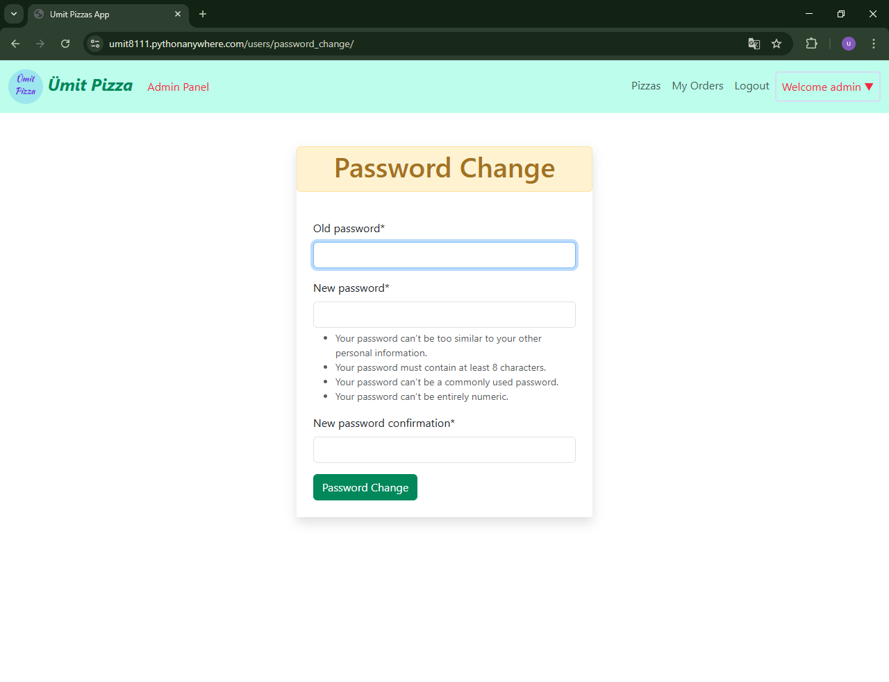

<!-- Please update value in the {}  -->

<h1 align="center">Project_Django_Template_Pizza_Ordering_App</h1>


<div align="center">
  <h3>
    <a href="https://umit8111.pythonanywhere.com/">
      Canlı Demo
    </a> 
  </h3>
</div>

<!-- TABLE OF CONTENTS -->

## Table of Contents

- [Table of Contents](#table-of-contents)
- [Overview](#overview)
  - [Kullanıcı Kayıt Olma](#kullanıcı-kayıt-olma)
  - [Kullanıcı Login](#kullanıcı-login)
  - [Kullanıcı Password Change](#kullanıcı-password-change)
- [Built With](#built-with)
- [How To Use](#how-to-use)
- [About This Project](#about-this-project)
- [Acknowledgements](#acknowledgements)
- [Contact](#contact)

<!-- OVERVIEW -->

## Overview

### Kullanıcı Kayıt Olma
<!--  -->

➡ Kullanıcıların uygulamaya kayıt olma sayfası.


---

### Kullanıcı Login
<!--  -->

➡ Kullanıcıların giriş yaparak blog gönderilerine erişim sağlayabileceği ekran.

---

### Kullanıcı Password Change
<!--  -->

➡ Şifre değiştirme işlemi için kullanılan doğrulama ekranı.

---

- Todo App Order / Password Change


---

- Todo App Login


---

## Built With

<!-- This section should list any major frameworks that you built your project using. Here are a few examples.-->

- Django Templates
- JavaScript
- Bootstrap5
- HTML
- CSS

## How To Use

<!-- This is an example, please update according to your application -->

To clone and run this application, you'll need [Git](https://github.com/Umit8098/Project_Django_Templates_Pizza_App_CH-12_V.03)

When installing the required packages in the requirements.txt file, review the package differences for windows/macOS/Linux environments. 

Complete the installation by uncommenting the appropriate package.

---

requirements.txt dosyasındaki gerekli paketlerin kurulumu esnasında windows/macOS/Linux ortamları için paket farklılıklarını inceleyin. 

Uygun olan paketi yorumdan kurtararak kurulumu gerçekleştirin.

```bash
# Clone this repository
$ git clone https://github.com/Umit8098/Project_Django_Templates_Pizza_App_CH-12_V.03.git

# Install dependencies
    $ python -m venv env
    $ python3 -m venv env (for macOs/linux OS)
    $ env/Scripts/activate (for win OS)
    $ source env/bin/activate (for macOs/linux OS)
    $ pip install -r requirements.txt
    $ python manage.py migrate (for win OS)
    $ python3 manage.py migrate (for macOs/linux OS)

# Create and Edit .env
# Add Your SECRET_KEY in .env file

"""
# example .env;

SECRET_KEY =123456789abcdefg...
"""

# Run the app
    $ python manage.py runserver
```

## About This Project
- Pizza Ordering Application

<hr>

- Pizza Ordering Application

## Acknowledgements
- [Bootstrap5](https://getbootstrap.com/) - CSS Framework
- [crispy-forms](https://django-crispy-forms.readthedocs.io/en/latest/) - CSS framework used for forms.

## Contact

<!-- - Website [your-website.com](https://{your-web-site-link}) -->
- GitHub [@Umit8098](https://github.com/Umit8098)

- Linkedin [@umit-arat](https://linkedin.com/in/umit-arat/)
<!-- - Twitter [@your-twitter](https://{twitter.com/your-username}) -->
