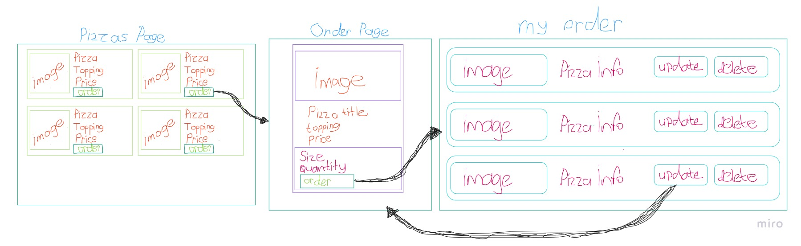
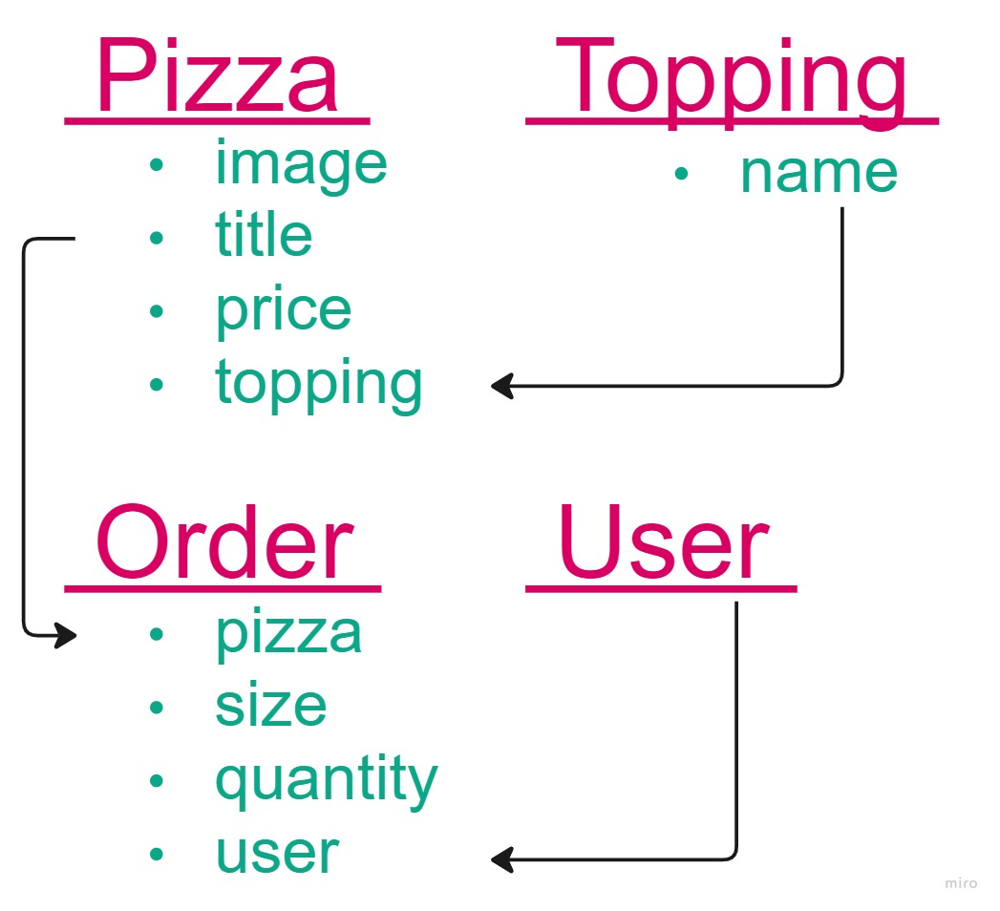

## 024.ders_PizzaApp_V.01-Templates-UserAuthentication-register-login-logout-Navbar-Bootstrap-image-Messages-timeout_js

## Create project and app

```powershell
- py -m venv env
# - python3.10 -m venv env
- ./env/Scripts/activate
- pip install django
- pip install python-decouple
- pip freeze > requirements.txt
- django-admin startproject main .
- py manage.py startapp pizzas
```

- create .env and .gitignore files, hidden to SECRET_KEY.
  
- Create .env file on root directory. We will collect our variables in this file.
```py
SECRET_KEY = o5o9...
```
- Migrate dbs:
```py
python manage.py migrate
```

- Create superuser:
```
- python manage.py createsuperuser
- py manage.py runserver
```

--------------------------------------------------
--------------------------------------------------

- Ready to go!

      - app oluştur, kur, 
      - urls ini projeye bağla, 
      - model oluştur,
      - form oluştur,
      - view oluştur,
      - urls ini bağla,
      - template leri oluştur,

--------------------------------------------------
--------------------------------------------------

- urls configurasyonu yapıyoruz. main urls.py ında pizzas app imizin urls.py ını önce oluşturup sonra include ediyoruz.

main.urls ->
```py
from django.contrib import admin
from django.urls import path, include

urlpatterns = [
    path('admin/', admin.site.urls),
    path('', include('pizzas.urls')),
]
```

pizzas.urls ->
```py
from django.urls import path

urlpatterns = [
    # path('', , name=''),
]
```

- Basit bir view yazıyoruz, 
views.py ->
```py
from django.shortcuts import render

# Create your views here.
def home(request):
    return render(request, 'pizzas/home.html')
```

- Bu home view inin endpointini yazıyoruz,

pizzas.urls ->
```py
from django.urls import path
from .views import (
    home,
)

urlpatterns = [
    path('', home, name='home'),
]
```


##### navbar, base, home templates;

- Bu home view inin endpointinin template ini yazıyoruz, Ama önce bir base.html oluşturup ardından home.html oluşturup base.html i extend edeceğiz.

base.html ->

```html
<!DOCTYPE html>
<html lang="en">
<head>
    <meta charset="UTF-8">
    <meta http-equiv="X-UA-Compatible" content="IE=edge">
    <meta name="viewport" content="width=device-width, initial-scale=1.0">
    <title>Umit Pizzas App</title>
</head>
<body>

    <h1>Base Template</h1>
    
    
        
    
        
</body>
</html>
```

home.html ->

```html



    <h2>Home Page</h2>

    
```

- Bir navbar ekleyeceğiz. Bootstrap kullanacağız, cdn linklerini base.html de ilgili kısma ekliyoruz.

base.html ->

```html
<!DOCTYPE html>
<html lang="en">
<head>
    <meta charset="UTF-8">
    <meta http-equiv="X-UA-Compatible" content="IE=edge">
    <meta name="viewport" content="width=device-width, initial-scale=1.0">
    <link href="https://cdn.jsdelivr.net/npm/bootstrap@5.3.0-alpha1/dist/css/bootstrap.min.css" rel="stylesheet" integrity="sha384-GLhlTQ8iRABdZLl6O3oVMWSktQOp6b7In1Zl3/Jr59b6EGGoI1aFkw7cmDA6j6gD" crossorigin="anonymous">
    <title>Umit Pizzas App</title>
</head>
<body>

    <h1>Base Template</h1>
    
    
        
    
    
    <script src="https://cdn.jsdelivr.net/npm/bootstrap@5.3.0-alpha1/dist/js/bootstrap.bundle.min.js" integrity="sha384-w76AqPfDkMBDXo30jS1Sgez6pr3x5MlQ1ZAGC+nuZB+EYdgRZgiwxhTBTkF7CXvN" crossorigin="anonymous"></script>
    
</body>
</html>
```

##### statics ;

- Projemizde çeşitli static file larımız olacak onun için setting.py da static ayarları için kodlarımızı yapıştırıyoruz. Bu ayarlar genelde değişmez, bunları direkt alıp projelerinizde kullanabilirsiniz.

settings.py ->

```py
# static settings ayarları ********
import os
STATIC_URL = '/static/'
STATICFILES_DIRS = [os.path.join(BASE_DIR, 'static')]

# MEDIA FILES

MEDIA_URL = '/media/'
MEDIA_ROOT = os.path.join(BASE_DIR, 'media')
# static settings ayarları ********
```

- Static file larımızı oluşturuyoruz, root directory de static/css, images, js yapısında klasörlerimizi oluşturuyoruz.

- css klasörümüzün içine style.css dosyamızı oluşturuyoruz,
style.css ->
```css

```

- base.html de style.css e link veriyoruz. Bir de sayfanın en üstünde load static tag ini ekliyoruz.
base.html ->
```html


    <link rel="stylesheet" href="">
```

- navbar için navbar.html template i oluşturup base.html de include edeceğiz.
navbar.html ->
```html

    <!-- navabar start -->
    <nav class="navbar navbar-expand-lg navbar navbar-white">
        <div class="container-fluid ">
            <a class="navbar-brand alert-warning text-success fs-4 fw-bolder fst-italic" href="/">
            
            Ümit Pizza</a>
            
            <div class="collapse navbar-collapse" id="navbars-host">
                <ul class="navbar-nav ms-auto">         
                    <li class="nav-item"><a class="nav-link" href="#">Pizzas</a></li>
                </ul>
            </div>
        </div>
    </nav>
```

- base.html de navbar.html 'i include ediyoruz.
base.html ->
```html
    
```

- css kalsörümüzün içine style.css dosyamızda navbarımıza background-color veriyoruz.
style.css ->
```css
.navbar {
    /* background-color: rgb(209,230,222); */
    background-color: rgb(203, 252, 233);
}
```

### Authentication Register, Login, Logout 

- Authentication işlemleri için users isminde yeni bir app oluşturacağız. 

```powershell
- py manage.py startapp users
```

- urls configurasyonunu yapıyoruz.

main.urls ->
```py
    path('users/', include('users.urls')),
```

users.urls ->
```py
from django.urls import path
from .views import (
    register,
)

urlpatterns = [
    path('register/', register, name='register'),
]
```

- yazdığımız endpoint için register view i oluşturuyoruz.
views.py
```py
from django.shortcuts import render

def register(request):
    return render(request, 'users/register.html')
```

- Şimdi bu endpointimiz için bir register.html template i oluşturacağız.
- users/templates/register.html yapısı içerisinde oluşturuyoruz.
- Bu template te de base.html i extend ediyoruz.

register.html ->
```html



    <h2>Register Page</h2>

```

- navbar.html e Pizzas ın altına Register isminde bir link daha ekliyoruz.
navbar.html ->
```html
    <li class="nav-item"><a class="nav-link" href="">Register</a></li>
```

#### Register

- Register işlemi için en temelde kullanıcıya bir form verip onu doldurup register olmasını sağlayacağız.
- İlk etapta bu form için djangonun default UserCreationForm unu import edip, inherit ederek kullanacağız.
- views.py da UserCreationForm u django.contrib.auth.forms dan import ediyoruz, 

users/views.py ->
```py
from django.shortcuts import render
from django.contrib.auth.forms import UserCreationForm

def register(request):
    form = UserCreationForm()
    context = {
        'form': form,
    }
    return render(request, 'users/register.html', context)
```

- register view imizin endpointini yazıyoruz, 

urls.py ->
```py
from django.urls import path
from .views import (
    register,
)

urlpatterns = [
    path('register/', register, name='register'),
]
```

- endpoint ini yazdığımız register view inin template inde context içerisinde göndrerdiğimiz formu yakalayıp kullanıcıya gösteriyoruz.

users/templates/users/register.html ->
```html



    <h2>Register Page</h2>
    <form action="">
        
        {{ form }}
    </form>

```

- bootstrap özelliklerini de kullanarak bu formu güzelleştirelim.

users/templates/users/register.html ->
```html



<div class="col-lg-4 mx-auto p-0 shadow mt-5">
    <div class="alert alert-warning text-center p-1">
        <h2>Registration</h2>
    </div>
    <div class="p-4 d-flex align-items-center ">
        <form action="" method="POST">
             
            {{ form }}
            <hr>
            <input type="submit" value="Register" class="btn btn-success">
        </form>
    </div>
</div>
```

- register formumuzu kullanıcıya gönderdik ama içeriğindeki veriler ile kullanıcıyı register edeceğiz.
- views.py da Post ile gelen istek içerisindeki verileri işliyoruz..

users/views.py ->
```py
from django.shortcuts import render, redirect
from django.contrib.auth.forms import UserCreationForm

def register(request):
    form = UserCreationForm()
    if request.method == 'POST':
        form = UserCreationForm(request.POST)
        if form.is_valid():
            form.save()
            return redirect('home')    
    context = {
        'form': form,
    }
    return render(request, 'users/register.html', context)
```

- Test ediyoruz, register formu doldurup bizi home page e redirect ettiğini gördük. Admin panelden de kullanıcıyı register ettiğini gördük.


##### register view'de kullanılan form'a unique email field'ı ekleme;

- register form u kendimize göre düzenleyeceğiz, handle edeceğiz, override edeceğiz.
- users app imizin içinde forms.py oluşturuyoruz,
- UserCreationForm u django.contrib.auth.forms dan import ediyoruz.
- Yine User modelimizi django.contrib.auth.models den impor ediyoruz.
- Şimdi kendimize, djangonun default User modeli ve UserCreationForm undan inherit ederek UserForm isminde bir form oluşturacağız.

users/froms.py ->
```py
from django.contrib.auth.forms import UserCreationForm
from django.contrib.auth.models import User

class UserForm(UserCreationForm):
    class Meta:
        model = User
        fields = ('username', 'email', 'password1', 'password2')
```

- Artık register view imizde yeni oluşturduğumuz UserForm u kullanacağız.
- views.py a gidip UserForm u  import edip kullanıyoruz.

users/views.py ->
```py
from django.shortcuts import render, redirect
from django.contrib.auth.forms import UserCreationForm
from .forms import UserForm

def register(request):
    # form = UserCreationForm()
    form = UserForm()
    if request.method == 'POST':
        # form = UserCreationForm(request.POST)
        form = UserForm(request.POST)
        if form.is_valid():
            form.save()
            return redirect('home')    
    context = {
        'form': form,
    }
    return render(request, 'users/register.html', context)
```

- Test ettik çalışıyor. 
- Ancak register template inde gösterilen formdaki fieldlar gözümüze çok iyi görünmedi. Onları kendimiz yazıyoruz şöyle;
- Önce importlarımızı yapıyoruz;
- djangodan forms u import ediyoruz,
- django.contrib.auth dan password_validation ı import ediyoruz,
- django.contrib.auth.forms dan UserCreationForm, UsernameField ı import ediyoruz,

users/froms.py ->

```py
from django.contrib.auth.forms import UserCreationForm
from django.contrib.auth.models import User

from django import forms
from django.contrib.auth import password_validation
from django.contrib.auth.forms import UserCreationForm, UsernameField

class UserForm(UserCreationForm):
    
    # class Meta:
    #     model = User
    #     fields = ('username', 'email', 'password1', 'password2')
    
    username = UsernameField(
        label=(""),
        widget=forms.TextInput(attrs={"autofocus": True,'class' : "rounded border border-warning form-control shadow-lg m-2", "placeHolder" :"username"})
        )
    
    password1 = forms.CharField(
        label=(""),
        widget=forms.PasswordInput(attrs={'class' : "rounded border border-warning form-control shadow-lg m-2", "placeHolder" :"password"}),
        help_text=password_validation.password_validators_help_text_html(),
    )
    
    password2 = forms.CharField(
        label=(""),
        widget=forms.PasswordInput(attrs={'class' : "rounded border border-warning form-control shadow-lg m-2", "placeHolder" :"Password confirmation"}),
        help_text=("* Enter the same password as before, for verification."),
    )

```

- registration için üç yöntem gösterdik; 
  1- UserCreationForm u direkt olarak view'de kullanmak,
  2- forms.py oluşturup UserCreationForm dan inherit ederek default User modelini kullanarak oluşturduk, 
  3- forms.py oluşturup UserCreationForm dan inherit ederek formumuzun fieldlarını kendimiz oluşturarak set etmiş olduk. field lara class vererek bootstrap özelliklerini kullandık.


- Ben ekstradan kullanıcıdan email de almak istiyorum.
- Bunun için aşağıdaki kodları ekliyorum.

forms.py ->
```py
    email = forms.EmailField(
        required=False,
        label=(""),
        widget=forms.EmailInput(attrs={"autofocus": True,'class' : "rounded border border-warning form-control shadow-lg m-2 mt-3", "placeHolder" :"email"})
    )

    # email kaydediliyor, Email'in unique olması gerekmiyor.
    def save(self, commit=True):
        user = super(UserForm, self).save(commit=False)
        user.email = self.cleaned_data["email"]
        if commit:
            user.save()
        return user
```

- Evet artık formumda email field ı var. Kullanıcıdan email ini de alıp kaydediyor.
- Fakat biz ayrıca kullanıcının girdiği email in unique olmasını da istiyoruz. Yani aynı email ile birden fazla user register olamasın.
- ValidationError u django.core.exceptions dan import edip, aşağıdaki kodları ekliyorum.

forms.py ->
```py
from django.core.exceptions import ValidationError

    # Email'in olması ve unique olması gerekiyor.
    def clean(self):
       email = self.cleaned_data.get('email')
       if User.objects.filter(email=email).exists():
            raise ValidationError("Email exists")
       return self.cleaned_data
```

- Test ediyoruz, çalışıyor. Artık aynı email ile başka bir user register olamıyor.


#### Login

- Login için de hemen hemen aynı basamakları uygulayacağız, login view -> endpoint -> render edilecek login template
- views.py da user_login isminde view imizi yazmaya başlıyoruz.

views.py ->
```py
def user_login(request):
    return render(request, 'users/login.html')
```

urls.py ->
```py
from django.urls import path
from .views import (
    register,
    user_login,
)
urlpatterns = [
    path('register/', register, name='register'),
    path('login/', user_login, name='login'),
]
```

users/login.html ->
```html



    <h2>Login page</h2>

```

- login için navbarda Register buttonunun üstüne Login button u ekliyoruz,

navbar.html ->
```html
<li class="nav-item"><a class="nav-link" href="">Login</a></li>
```

- Şimdi kullanıcının login olabilmesi için ona login template inde bir form sunmamız ve onu doldurup post isteği ile bize gönderdiği zaman bizim o form ile views.py da kllanıcıyı login edip home page e redirect etmemiz lazım.
- forms.py da login işlemi için djangonun default AuthenticationForm diye bir formu var. AuthenticationForm u django.contrib.auth.forms dan import edip, ondan inherit ederek kendi LoginForm umuzu oluşturacağız. 

forms.py ->
```py
from django.contrib.auth.forms import (
    UserCreationForm, 
    UsernameField, 
    AuthenticationForm,
)
class LoginForm(AuthenticationForm):
    username = UsernameField(widget=forms.TextInput(attrs={"autofocus": True, 'class' : "rounded border border-warning form-control shadow-lg m-2", "placeHolder" :"username"}))
    password = forms.CharField(
        label=("Password"),
        widget=forms.PasswordInput(attrs={'class' : "rounded border border-warning form-control shadow-lg m-2", "placeHolder" :"password"}),
    )
```

- oluşturduğumuz bu LoginForm u views.py da import ederek user_login view imizden context yapısı ile template imize gönderiyoruz.
views.py ->
```py
from .forms import (
    UserForm, 
    LoginForm,
)
def user_login(request):
    form = LoginForm()
    context = {
        'form': form,
    }
    return render(request, 'users/login.html', context)
```

- context içerisinde gönderdiğimiz form u template imiz içerisinde yakalıyoruz,
- Bootstrap kodları ile de daha düzgün görünmesini sağlıyoruz.
login.html ->
```html



<div class="col-lg-2 mx-auto p-0 shadow mt-5 ">
    <div class="alert alert-warning text-center">
        <h2>Login</h2>
    </div>
    <div class="p-4 d-flex align-items-center ">
        <form action="" method="POST">
             
            {{ form }}
            <hr>
            <input type="submit" value="LOGIN" class="btn btn-success">
        </form>
    </div>
</div>

```

- Şimdiye kadar register yaptık, login işleminin template ini yaptık ama henüz kullanıcı template inden post methodu ile istek attığında gerçekleşecek işlemi views.py da yapmadık.
- Şmdi views.py da kullanıcıyı login edeceğiz.
- form valid ise;
- form dan user ı çekip, django nun default login() fonksiyonuna sokacağız.
- < user = form.get_user() > ile form dan get_user() methodu (arka planda çalışan bir method) ile user ı çekip user değişkenine tanımlıyoruz,
- Ve bu user değişkeninen tanımlı user ı djangonun login() fonksiyonuna gönderiyoruz.
- login fonksiyonunu django.contrib.auth dan import ediyoruz.
- login(request, user) ile user ı login ediyoruz.
- login olduktan sonra home template ine redirect ediyoruz.

views.py ->
```py
from django.contrib.auth import login

def user_login(request):
    form = LoginForm()
    if request.method == 'POST':
        form = LoginForm(request, data=request.POST)
        if form.is_valid():
            user = form.get_user()
            login(request, user)
            return redirect('home')
    context = {
        'form': form,
    }
    return render(request, 'users/login.html', context)
```

- home template ine redirect ediyoruz ama gerçekten login olmuş mu diye home template ine bir data ekliyoruz.
- home template ine gidip;
home.html ->
```html



    <h2>Home Page</h2>
    
        <h2>Welcome {{ request.user.username }}</h2>
    

    
```

##### admin user giriş yaparsa, ona navbarda Admin Panel için bir link verelim;

navbar.html
```py
...
    <div class="container-fluid ">
        <a class="navbar-brand alert-warning text-success fs-4 fw-bolder fst-italic" href="/">
        
        Ümit Pizza</a>
        
        <a class="nav-link text-danger" href="/admin">Admin Panel</a>
        
...
```


#### Logout

- Logout için views.py da user_logout view i oluşturuyoruz. 
- logout için bir template e ihtiyaç duymuyoruz, logout yapınca bizi home template ine render etmesini sağlayacağız.
- Bunu da yine djangonun default logout() fonksiyonu ile yapıyoruz. logout(request) parametresi alıyor.
- Tabi önce logout u django.contrib.auth dan import ediyoruz.
- logout yaptıktan sonra home template ine redirect ediyoruz.

views.py ->
```py
from django.contrib.auth import login, logout

def user_logout(request):
    logout(request)
    return redirect('home')
```

- user_logout view imizin endpointini yazıyoruz

urls.py ->
```py
from django.urls import path
from .views import (
    register,
    user_login,
    user_logout,
)
urlpatterns = [
    path('register/', register, name='register'),
    path('login/', user_login, name='login'),
    path('logout/', user_logout, name='logout'),
]
```

- navbar template ine Login buttonunun üzerine Logout buttonu ekleyip, logout endpointine tetikleyip, user_logout view inin çalışmasını sağlıyoruz. O da bizi logout edip home template ine redirect ediyor.   
- Ayrıca yine navbarda kullanıcı login ise sadece logout buttonu görünsün, değil ise register ve login buttonları görünsün.

navbar.html ->
```html
                    
                    <li class="nav-item"><a class="nav-link" href="#">Welcome {{user}}</a></li>
                    <li class="nav-item"><a class="nav-link" href="">Logout</a></li>
                    
                    <li class="nav-item"><a class="nav-link" href="">Register</a></li>
                    <li class="nav-item"><a class="nav-link" href="">Login</a></li>
                    
```


- Geldiğimiz noktada bir kullanıcı register olduğunda aynı zamanda login olmuş olmuyor. Biz bir kullanıcı register olur olmaz aynı zamanda login de olsun istiyoruz.
- Bunun için yine register view imize gidip, kullanıcı register olduktan sonra login edeceğiz.
- register view inde form.save() komutu ile bir user create etmiş oluruz. İşte bu komut ile bir user değişkeni oluşturup, bu user değişkenini de login(request, user) fonksiyonuna request ile birlikte parametre olarak gönderirsek, register olmuş user ı aynı zamanda login de etmiş oluruz. 

views.py ->
```py
def register(request):
    form = UserForm()
    if request.method == 'POST':
        form = UserForm(request.POST)
        if form.is_valid():
            
            user=form.save()
            login(request, user)
            
            # form.save()
            # username = form.cleaned_data.get('username')
            # password = form.cleaned_data.get('password1')
            # user = authenticate(username=username, password=password)
            # login(request, user)
            
            return redirect('home')    
    context = {
        'form': form,
    }
    return render(request, 'users/register.html', context)
```

- Test ediyoruz çalıştı.


#### Image ekleme;

- home template imize image ekleyeceğiz.
- home template imize gidiyoruz ve , artık ihtiyacımız olmayan h2 tag i ve if condition ı siliyoruz.

home.html ->
```html



<div class="homeImage">
    <h1>Home page</h1>
</div>

```

- home template imizdeki homeImage class ı verdiğimiz div e style.css fosyasından background image vereceğiz.

stayle.css ->
```css
.navbar {
    /* background-color: rgb(209,230,222); */
    background-color: rgb(203, 252, 233);
}

.homeImage {
    background-image: url('../images/nadiasgarden.jpg');
    height: calc(100vh - 106px);
    background-size: cover;
    background-position: center;
}
```

#### Message ekleme;

- login, logout olunduğunda flash message ekleyelim.
- views.py da login, logout viewlerinde işlem tamamlandığında mesage ekleyeceğiz.
- önce django.contrib den messages ı import ediyoruz.
- ardından register view imizde login olduktan sonra bizi redirect edeceği home template inde messages ımızı görmek istiyoruz.
- ardından login view imizde login olduktan sonra bizi redirect edeceği home template inde messages ımızı görmek istiyoruz.
- bir de logout view imizde logout olduktan sonra bizi redirect edeceği home template inde messages ımızı görmek istiyoruz.
- messages tag leri farklı, login success, logout warning. Ona göre style verilecek.

views.py
```py
from django.contrib import messages

            login(request, user)            
            messages.success(request, 'Congratulations, you have registered.')
            return redirect('home')    


            login(request, user)
            messages.success(request, 'You are now logged in.')
            return redirect('home')


            logout(request)
            messages.warning(request, 'You are now logged out.')
            return redirect('home')

```

- Bu messages ı görmemiz için template lerde message yapısını eklememiz lazım. Nerede görmek istiyoruz bu messagesları? Bizi login olduktan sonra redirect edeceği home template inde messages ımızı görmek istiyoruz.
- home template imize gidip, 
- messages lar genelde standarttır, çok değişmez. bir messages container ı içerisinde gelir, genelde for ile dönüp ekrana yansıtılır. Buna style verilmek istenirse class veya id verilerek style ı ayarlanabilir. 

home.html ->
```html




<div class="homeImage">
     
         
            
                <div id="warning" class="message rounded col-md-2">{{ message }}</div>
            
                <div id="success" class="message rounded col-md-2">{{ message }}</div>
             
         
    
</div>

```

- Burada id ile style.css de styling verilmiş.
style.css
```css
#warning {
    margin-top: 5px;
    background-color: lightcoral;
    color: aliceblue;
    margin: auto;
    height: 40px;
    text-align: center;
}

#success {
    margin-top: 5px;
    background-color: darkseagreen ;
    color:rgb(231, 200, 158);
    margin: auto;
    height: 40px;
    text-align: center;
}
```


#### js ekleme;

- Test ettik çalışıyor. Ama message geldikten sonra kaybolmuyor. Bunun için javascript kodu yazacağız.

js/timeout.js ->
```js
let element = document.querySelector('.message')

setTimeout(() => {
    element.style.display='none'
}, 2000)
```

- Yazdığımız bu javascript kodunun bulunduğu dosyayı base.html de script tagı içinde template imize ekliyoruz.

base.html ->
```html 
<script src=""></script>
``` 


## V.02  Auth. -> Password_Change, Password_Reset... 

#### Authentication Password İşlemleri;

- password_change, 
- password_change_done, 
- password_reset, 
- password_reset_confirm, 
- password_reset_done, 
- password_reset_complete

- djangonun default olarak sunduğu bu template leri kendimize uyarlayacağız.
 
- Normalde bir projeye başlarken, djangonun default olarak sunduğu register, login, logout ve diğer password işlemlerinin sergilendiği template ler için proje klasörü altında user işlemlerinin yapılacağı ve de isminin user dışında bir isimle isimlendirilen bir app oluşturulur (app ismi olarak user kullanınca kendi default değerleri ile çalışabiliyor.). 
- Bu app in altında templates/registration/login.html yapısı ile tüm templateler oluşturulur. 
- Bunun sebebi de biz djangonun default template lerini kullanırken onların kayıtlı olduğu registration klasörünü ezmemiz gerekiyor. 
- Ancak bu projede register, login template leri templates/users/login.html yapısı ile kaydedilmiş. 
- Biz registration klasörünün altında;
 - password_change, 
 - password_change_done, 
 - password_reset, 
 - password_reset_confirm, 
 - password_reset_done, 
 - password_reset_complete 
    templatelerini oluşturacağız.

template_name="registration/password_reset_done.html"

- Ancak burada ince bir detay var; settings.py' daki INSTALLED_APPS kısmındaki app imiz sıralama olarak en altta. Fakat default 'django.contrib.admin' app i ise en üstte ve bizim customize etmeye çalıştığımız template te o app de var. 
- Dolayısıyla sıralamada üstte olan app in template'i okunduğu için bizim app imizin içindeki customize ettiğimiz template render edilmiyor.
- Bunun önüne geçmek için bizim app imizi (users app)INSTALLED_APPS kısmında en üst sıraya yerleştirerek bunun önüne geçiyoruz.

setting.py -> 
```py
INSTALLED_APPS = [
    # my_apps
    'users',
    'django.contrib.admin',
    ....
]
```

- users app imizin içine registration isminde klasörümüzü oluşturuyoruz.

- ana urls.py da djangonun default accounts/ path ini include ediyoruz. Bunu users işlemlerini yaptığımız app in urls.py ında da include edebilirdik. Ancak o zaman default password template'lerinin üstüne çıkamıyoruz. Buyüzden ana urls.py'da include ediyoruz. 

proj/urls.py ->
```py
    path('accounts/', include('django.contrib.auth.urls')),
```

- users app imizin urls.py ına django.contrib.auth dan views as auth_views i import ediyoruz.

users/urls.py ->
```py
from django.contrib.auth import views as auth_views
```

##### Password Change

- password_change.html  oluşturacağız, django password_change için kendi administration sayfasında (accounts/password_change) kendi hazır template ine yönlendiriyor. 
- Biz bu template e yönlenmek istemiyoruz. Kendi template imizi koyup render etmek istiyoruz. 
- Ancak bu form ve view bizim için hazır biz sadece template ini kendimize göre değiştireceğiz.

users/urls.py ->
```py
    path('password_change/', auth_views.PasswordChangeView.as_view(template_name="registration/password_change.html"), name='password_change'),
```

- Biz password_change için bir view yazmadık, urls.py da görüldüğü gibi auth.views deki PasswordChangeView ini alıp, onu customize ettik, as_view içerisindeki template name parametresini değiştirmişiz. (default olarak register/password_change_form.html olması gereken template ismini register/password_change.html olarak customize ettik.)
- endpoint i yazdık, şimdi djangonun default template i yerine kendi kullanacağımız template i registration klasörü içinde password_change.html ismi ile oluşturuyoruz.

password_change.html
```html
<h1>Password Change</h1>
<form action="" method="post">
    
    {{ form.as_p }}
    <input type="submit" value="Password Change">
</form>
```

##### Password Change Done

- password_change ile password ümüzü değiştirdikten sonra django bizi bir sayfaya yönlendirdi. Ancak biz buraya yönlenmesini değil de kendi sayfamıza yönlendirilsin istiyoruz. 
- PasswordChangeView den sonra  PasswordChangeDoneView
- Fakat burada PasswordChangeView de olduğ gibi birtürlü override edemedim o yüzden gösterdiği ikinci yöntemle yani sadece dokümandaki default ismi ile bir template oluşturup password_change_done.html, INSTALLED_APPS de de zaten yukarı almıştım kendi app imi o yüzden benim oluşturduğum app in içindeki template i render edecektir.

users/urls.py ->
```py
    path('password_change_done/', auth_views.PasswordChangeDoneView.as_view(template_name="registration/password_change_done.html"), name='password_change_done'),
```

- djangonun default template i yerine kendi template imizi yazıyoruz. Bir de home page için link veriyoruz.

password_change.html
```html
<h1>Password change succesful</h1>

<p>Your password was changed.</p>

<a class="navbar-brand alert-warning" href="">Home</a>
```


##### Password Reset

users/urls.py ->
```py
    path('password_reset/', auth_views.PasswordResetView.as_view(template_name="registration/password_reset.html"), name='reset'),

```

- template ini yazıyoruz.

password_reset.html
```html
<h1>Password Reset</h1>
<form action="" method="post">
    <p>Forgotten your password? Enter your email address below, and we’ll email instructions for setting a new one.</p>
    
    {{ form.as_p }}
    <input type="submit" value="Reset my password" />
</form>

```

- Bundan sonra biz buraya mail adresimizi girdiğimiz zaman bize bir tane mail gönderecek, burada djangonun development için arkada set ettiği console backend diye bir email backend i var. Consolda bize email in bir dummy sini gösteriyor.
  
### Adjust a mail backend for development (Console backend):
    Geliştirme için bir posta arka ucunu ayarlayın

Instead of sending out real emails the console backend just writes the emails that would be sent to the standard output. By default, the console backend writes to stdout. You can use a different stream-like object by providing the stream keyword argument when constructing the connection.

Konsol arka ucu, gerçek e-postalar göndermek yerine, standart çıktıya gönderilecek e-postaları yazar. Varsayılan olarak, konsol arka ucu stdout'a yazar. Bağlantıyı oluştururken akış anahtar sözcüğü argümanını sağlayarak akışa benzer farklı bir nesne kullanabilirsiniz.

To specify this backend, put the following in your settings:
Bu arka ucu belirtmek için settings.py a aşağıdakileri koyun:

```py
EMAIL_BACKEND = 'django.core.mail.backends.console.EmailBackend'
```

- dokümandan console backend e gidiyoruz;
  
https://docs.djangoproject.com/en/4.1/topics/email/

şu ayarı settings.py a yazmamız gerekiyor:

settings.py
```py
EMAIL_BACKEND = 'django.core.mail.backends.console.EmailBackend'
```

- Bir de önemli olan husus password reset yapacak user ın kayıtlı e-mail inin olması gerekiyor. Artık password_reset template inde e postayı girip resete tıkladığımızda bizi yönlendirdiği sayfayı da dokümandan template ismi ile registration klasörü altında oluşturup kendi template imizi yazıyoruz; -> 


##### Password Reset Done

users/urls.py ->
```py
    path("password-reset/done/", auth_views.PasswordResetDoneView.as_view(template_name="registration/password_reset_done.html"), name="reset_done"),
```

- template ini yazıyoruz.

password_reset_done.html
```html
<h1>Password reset sent</h1>
<p>We’ve emailed you instructions for setting your password, if an account exists with the email you entered. You should receive them shortly.</p>

<p>If you don’t receive an email, please make sure you’ve entered the address you registered with, and check your spam folder.</p>
```

##### Password Reset Confirm

users/urls.py ->
```py
    path('password-reset-confirm/<uidb64>/<token>', auth_views.PasswordResetConfirmView.as_view(template_name='registration/password_reset_confirm.html'), name='password_reset_confirm'),

```

- template ini yazıyoruz.

password_reset_confirm.html
```html
<h1>Enter new password</h1>
<p>Please enter your new password twice so we can verify you typed it in correctly.</p>
<form action="" method="post">
    
    {{ form.as_p }}
    <input type="submit" value="Change my password" />
</form>
```

##### Password Reset Complete

users/urls.py ->
```py
    path('password-reset-complete/', auth_views.PasswordResetCompleteView.as_view(template_name='registration/password_reset_complete.html'), name='password_reset_complete'),
```

- template ini yazıyoruz.

password_reset_complete.html
```html
<h1>Password reset complete</h1>
<p>Your password has been set. You may go ahead and log in now.</p>

<a href=""><input type="submit" value="Login"></a>
```


##### Password templatelerinin django-crispy-forms ve bootstrap5 ile düzenlenmesi;

```bash
- pip install django-crispy-forms
- pip install crispy-bootstrap5
- pip freeze > requirements.txt
```

settings.py
```py
INSTALLED_APPS = [
    ...
    # third_party_package
    'crispy_forms',
    "crispy_bootstrap5",
]

CRISPY_ALLOWED_TEMPLATE_PACKS = "bootstrap5"

CRISPY_TEMPLATE_PACK = "bootstrap5"
...
```


password_change.html ->
```html



<div class="col-lg-4 mx-auto p-0 shadow mt-5">
    <div class="alert alert-warning text-center p-1">
        <h1>Password Change</h1>
    </div>
    <div class="p-4 d-flex align-items-center ">
        <form action="" method="post">
            
            {{ form | crispy }}
            <input type="submit" value="Password Change" class="btn btn-success"/>
        </form>
</div>

```


password_change_done.html ->
```html


<div class="col-lg-4 mx-auto p-0 shadow mt-5 ">
    <div class="alert alert-warning text-center">
        <h1>Password change succesful</h1>
    </div>
    <div class="p-4 align-items-center ">
        <p>Your password was changed.</p>
        <a href="" ><input type="submit" value="Login" class="btn btn-success"></a> 
        <a href="" ><input type="submit" value="Home" class="btn btn-success"></a> 
    </div>
</div>

```


password_reset.html ->
```html



<div class="col-lg-3 mx-auto p-0 shadow mt-5 ">
    <div class="alert alert-warning text-center">
        <h1>Password Reset</h1>
    </div>
    <div class="p-4 d-flex align-items-center ">
        <form action="" method="post">
            <p>Forgotten your password? Enter your email address below, and we’ll email instructions for setting a new one.</p>
            
            {{ form | crispy }}
            <input type="submit" value="Reset my password" class="btn btn-success"/>
        </form>
    </div>
</div>


```


password_reset_done.html ->
```html


<div class="col-lg-4 mx-auto p-0 shadow mt-5 ">
    <div class="alert alert-warning text-center">
        <h1>Password reset sent</h1>
    </div>
    <div class="p-4 align-items-center ">
        <p>We’ve emailed you instructions for setting your password, if an account exists with the email you entered. You should receive them shortly.</p>
        <p>If you don’t receive an email, please make sure you’ve entered the address you registered with, and check your spam folder.</p>
    </div>
</div>

```


password_reset_confirm.html ->
```html


<div class="col-lg-4 mx-auto p-0 shadow mt-5">
    <div class="alert alert-warning text-center p-1">
        <h2>Enter new password</h2>
    </div>
    <div class="p-4 d-flex align-items-center ">
        <form action="" method="post">
            <p>Please enter your new password twice so we can verify you typed it in correctly.</p>  
            
            {{ form.as_p }}
            <input type="submit" value="Change my password" class="btn btn-success"/>
        </form>
    </div>
</div>

```


password_reset_complete.html ->
```html


<div class="col-lg-4 mx-auto p-0 shadow mt-5 ">
    <div class="alert alert-warning text-center">
        <h1>Password reset complete</h1>
    </div>
    <div class="p-3 align-items-center ">
        <p>Your password has been set. You may go ahead and log in now.</p>
        <a href="" ><input type="submit" value="Login" class="btn btn-success"></a> 
    </div>
</div>

```


## V.03 -> Pizza App;

- Organization Chart

<br>
- Model Organization Chart



#### Modeller

pizzas/models.py

```py
from django.db import models
from django.contrib.auth.models import User

# Create your models here.
class Topping(models.Model):
    name = models.CharField(max_length=100)
    
    def __str__(self):
        return self.name

class Pizza(models.Model):
    name = models.CharField(max_length=100)
    toppings = models.ManyToManyField(Topping)
    image = models.ImageField(upload_to='pizza_pics', blank=True, null=True)
    price = models.DecimalField(max_digits=10, decimal_places=2)
    
    def __str__(self):
        return self.name

SIZE = (
    {'S', 'Small'},
    {'M', 'Medium'},
    {'L', 'Large'},
)
class Order(models.Model):
    pizza = models.ForeignKey(Pizza, on_delete=models.CASCADE)
    user = models.ForeignKey(User, on_delete=models.CASCADE)
    size = models.CharField(max_length=100, choices=SIZE, default='M')
    quantity = models.IntegerField(default=1)
    
    def __str__(self):
        return f'{self.user.username} ordered {self.pizza.name}'
```

- Modelde image field kullandığımız için pillow paketini yüklememizi istedi.

```powershell
- pip install Pillow
- pip freeze > requirements.txt
- py manage.py makemigrations
- py manage.py migrate
```

- admin.py da tablolarımızı register ediyoruz. 
```py
from django.contrib import admin
from .models import Topping, Pizza, Order 
# Register your models here.
admin.site.register(Topping)
admin.site.register(Pizza)
admin.site.register(Order)
```

- media files larını browserda görebilmemiz için proje/urls.py da ayarlarını yapmamız gerekiyor. 
- Standart ayarlarımızı proje/urls.py a ekliyoruz.

proje/urls.py ->

```py
...
# for media files
from django.conf import settings
from django.conf.urls.static import static

urlpatterns = [
    .....
] 
# for media files 
+ static(settings.MEDIA_URL, document_root=settings.MEDIA_ROOT)

if settings.DEBUG:
    urlpatterns += static(settings.STATIC_URL, document_root=settings.STATIC_ROOT)
```

- Veri girişleri (Pizzaların girişleri..) Admin panelden Tablolarımıza veri girişi yapıyoruz. Proje canlıya çıkmadan yönetici için bir template oluşturup bu veri girişlerini ToDo app gibi oradan da yaptırabiliriz. Biz şu an admin panelden yapacağız. 


##### Pizza Page

- Organization Chart tan bakıyoruz ve önce Pizza Page ini oluşturalım.
- card yapısında pizzaları çekip Pizzas Page de render edeceğiz. 

pizzas/views.py da 

```py
def pizzas(request):
    return render(request, 'pizzas/pizzas.html')
```

pizzas/urls.py da 

```py
    path('pizzas/', pizzas, name='pizzas'),
```
- view ini ve endpoint ini hazırladığımız template i pizzas/templates/pizza/pizzas.html olarak oluşturuyoruz.

pizzas/templates/pizza/pizzas.html
```html



    <h1>Pizzas Page</h1>    

```

- navbar daki pizzas linkini href kısmından aktif ediyoruz. 

navbar.html ->

```html
<li class="nav-item"><a class="nav-link" href="">Pizzas</a></li>
```

- Şimdi pizzas view inde db den Pizza modelimizdeki verileri çekip card içinde render edeceğiz. (Read işlemi yapacağız.)

pizzas/views.py da 

```py
from .models import (
    Pizza,
)

def pizzas(request):
    pizzas = Pizza.objects.all()
    context = {
        'pizzas': pizzas
    }
    return render(request, 'pizzas/pizzas.html', context)
```

- template imizde Pizza modelimizdeki objelerimizi yani context içerisinde pizzas değişkeni ile gönderdiğimiz objelerimizi çekip for döngüsüyle liste halinde gösteriyoruz.
pizzas/templates/pizza/pizzas.html ->

```html



    <h1>Pizzas Page</h1>
    <div>
        <ul>
            
                <li>{{ pizza }}</li>
            
        </ul>
    </div>

```

- Bunlara bootstrap ten bir card ayarlayalım; 

https://getbootstrap.com/docs/5.3/components/card/

- Horizantal isimli card yapısının kodlarını alıp for döngüsü içerisine yerleştiriyoruz.
- ul tag'ini siliyoruz.
- en dıştaki div'e ->
   class='d-flex flex-wrap justify-content-evenly mt-5'

- image'a -> src kısmına; "{{pizza.image.url}}" style="height: 100%; object-fit: cover;"
- for içindeki ilk div' e -> card m-3 shadow

- Her bir card içine ilgili datayı çağırarak işleyelim;

- Card title -> {{ pizza.name }}

- ilk p tag'inin içine toppings'leri yazalım, Fakat toppings'ler queryset olduğu için onları ul/li şeklinde yazacağız; -> ul/li içerisinde {{ pizza.toppings.all | join:', ' }}    ve  yine li ve strong tag'i ile  {{ pizza.price }} $

- login olmuş kullanıcıya göstermek istediğimiz order buttonu ekliyoruz. Login değilse sadece pizzaları görüntüleyebilsin.

pizzas/templates/pizza/pizzas.html ->
```html



    <!-- <div class='d-flex flex-wrap justify-content-around mt-5'> -->
    <div class='d-flex flex-wrap justify-content-evenly mt-5'>
            
            <div class="card m-3 shadow" style="max-width: 540px;">
                <div class="row g-0">
                  <div class="col-md-4">
                    
                  </div>
                  <div class="col-md-8">
                    <div class="card-body">
                      <h5 class="card-title">{{ pizza.name }}</h5>
                      <p class="card-text">
                        <ul>
                            <li>{{ pizza.toppings.all | join:', ' }}</li>
                            <li><strong>{{ pizza.price }} $</strong></li>
                        </ul>
                      </p>
                      
                        <a href=""><input type="button" value="Order" class="btn btn-warning ms-1"></a>
                      
                    </div>
                  </div>
                </div>
              </div>
                
    </div>

```

- NOT: get_FIELDNAME_display formatı choices kullandığımız fieldların value'sunu göstermek için kullanılır.

- Pizzas page template imiz tamam, 
- Order buttonu bizi Order Page ine göndermesi gerekiyor. Tabi hangi object ile order buttonu vasıtasıyla gittiğini anlaması için id yi de request in yanına parametre olarak yolluyoruz.

##### Order Page

- Önce Order Page i oluşturalım;

views.py ->
```py
def order_view(request, id):
    return render(request, 'pizzas/order.html')
```

urls.py ->
```py
    path('pizzas/<int:id>', order_view, name='order'),
```

order.html ->
```html



    <h1>Order Page</h1>

```

- pizzas.html template indeki Order buttonunun href ini düzelterek, order ismini verdiğimiz pizzas/<int:id> endpointi ile yönlendirdiğimiz order page template ini render ediyoruz.

pizzas.html ->

```html
<a href=""><input type="button" value="Order" class="btn btn-warning ms-1"></a>
```

- Order page template imiz, endpointimiz, view imiz çalışıyor. Şimdi order_view imizde id si ile yönlendiğimiz object imizin verilerini çekelim ve context içinde template e gönderelim, template imizde yakalayıp sergileyelim

views.py ->
```py
def order_view(request, id):
    pizza=Pizza.objects.get(id=id)
    context = {
        'pizza':pizza
    }
    return render(request, 'pizzas/order.html', context)
```

- order template imizde yine bootstrap ten bir card yapısı (Example) alıp bu yapı içinde çektiğimiz pizza objesini sergileyelim.
- ilgili kısımlarını değiştiriyoruz.
- 
order.html ->
```html



    <h1>Order Page</h1>
    <div class="card" style="width: 18rem;">
        
        <div class="card-body">
          <h5 class="card-title">{{ pizza.name }}</h5>
          <p class="card-text">
            <ul>
                <li>
                    {{ pizza.toppings.all | join:', ' }}
                </li>
                <li>
                    <strong>{{ pizza.price }} $</strong>
                </li>
            </ul>
          </p>
          <a href="#" class="btn btn-primary">Go somewhere</a>
        </div>
      </div>

```

- Order page de bir de kullanıcıya size ve quantity seçimleri yapması için bir form vereceğiz.
- pizzas app imizin altında forms.py oluşturup formumuzu yazıyoruz.
- Order modelimize baktığımızda, pizza, user, size, quantity fieldları var.
- Bu fieldlardan sadece size ve quantity fieldlarını kullanıcıdan isteyeceğiz. user ve pizza fieldlarını ise;
 - user'ı kendimiz ekleyeceğiz, o an kim sipariş veriyorsa onun user'ını ekleyeceğiz.
 - pizza field'ını ise seçili pizzadan ekleyeceğiz.
 - Ayrıca form içinde widgets ile; 
  - size choices fieldına RadioSelect veriyoruz.
  - quantity fieldına bootstrap ve inline/internal css veriyoruz.

pizzas/forms.py ->

```py
from django import forms
from .models import Order

class PizzaForm(forms.ModelForm):
    class Meta:
        model = Order
        fields = (
            'size',
            'quantity',
        )
        widgets = {
            'size':forms.RadioSelect,
            'quantity':forms.TextInput(attrs={'class':'rounded border border-warning form-control', 'style':'width:50%'}),
        }
```

- PizzaForm formumuzu yazdık ve şimdi views.py da import edip, 
- order_view ile kullanıcının doldurması için context içerisinde templat e gönderiyoruz.
- eğer içerisinde request.POST ile data geliyorsa formu dolu olarak gönder,
- eğer içerisinde request.POST ile data gelmyorsa, formu boş olarak context'e koyup template'e göndererek render et.
 
viws.py ->
```py
from .forms import PizzaForm

def order_view(request, id):
    pizza=Pizza.objects.get(id=id)
    form=PizzaForm(request.POST or None)
    context = {
        'pizza':pizza,
        'form':form
    }
    return render(request, 'pizzas/order.html', context)
```

order.html ->
```html
...
    <div>
      <form action="" method="POST">
          
          {{ form | crispy }}
          <input type="submit" value="Order" class="btn btn-primary">
      </form>
    </div>
...
```

- order.html in styling ini komple değiştiriyoruz;

pizzas/order.html ->
```html






<div class="col-lg-3 mx-auto d-flex justify-content-center align-items-center mt-5 mb-3">

  <!-- <div class="card" style="width: 18rem;"> -->
  <div class="card">
      
      <div class="card-body">
        <h5 class="card-title">{{ pizza.name }}</h5>
        <p class="card-text">
          <ul>
              <li>{{ pizza.toppings.all | join:', '}}</li>
              <li><strong>{{ pizza.price }}</strong></li>
          </ul>
        </p>
      
        <div>
          <form action="" method="POST">
              
              <!-- {{ form  }} -->
              {{ form | crispy }}
              <input type="submit" value="Order" class="btn btn-primary">
          </form>
        </div>
      </div>
  </div>
    
</div>



```

- kullanıcı order.html template ine yerleştirdiğimiz form u doldurup Post methodu ile istek atınca, formdaki verileri alıp, My Order page inde sergileyeceğiz.
- views.py da order_view imize gidip, kullanıcının Post methodu ile gönderdiği dolu formdaki verileri yakalayıp, üzerine formumuzu oluşturduğumuz Order modelinin diğer fieldları olan pizza ve user field larını da eklayip order modelinin object ini save ediyor ve home view ine redirect edeceğiz.
- eğer request.method Post ise;
    if request.method == "POST":
  - eğer form valid ise;
      if form.is_valid():
    - form'u save et, fakat db'ye kaydetme (commite=False) ve order değişkenine tanımla! (çünkü db deki tablonun user ve pizza fieldları hala eksik, onları ekleyeceğim.)
      order = form.save(commit=False)
    - order'ın pizza field'ı, hemen yukarıdaki pizza,
      order.pizza = pizza 
    - order'ın user field'ı, request'i yapan user,
      order.user = request.user 
    - order'ı save et!
      order.save() 
    - redirect home page
      return redirect('home')

views.py ->
```py
from django.shortcuts import render, redirect

def order_view(request, id):
    pizza=Pizza.objects.get(id=id)
    form=PizzaForm(request.POST or None)
    if request.method == 'POST':
        if form.is_valid():
            order=form.save(commit=False) # henüz db'ye kaydetme!
            order.pizza=pizza
            order.user=request.user
            order.save()
            return redirect('home')
    context = {
        'pizza':pizza,
        'form':form
    }
    return render(request, 'pizzas/order.html', context)
```

- Test ediyoruz, formu doldurup Order buttonuna bastığımızda bizi home page e redirect ediyor, db den Order tablosunu kontrol ettiğimizde de object in create edildiğini görüyoruz.

- (Ancak henüz kullanıcı olmayan birinin sayfaya erişimini engellemedik. Yani url de /pizzas/1 diye istek atarsa sayfaya erişebiliyor. Bunun önüne de geçeceğiz.)


##### My Order Page

- Şimdi user olarak kendi orderlarımızı görebileceğimiz bir template e (My Order Page) ihtiyacımız var. Onu oluşturacağız.
- views.py a gidip my_orders isminde view imizi oluşturuyoruz.

views.py
```py
def my_orders(request):
    return render(request, 'pizzas/my_orders.html')
```

urls.py ->
```py
    path('my_orders/', my_orders, name='my_orders'),
```

my_order.html ->
```html



    <h1>My Orders</h1>

```

- My Order Page e erişmek için navbar' a bir button ekliyoruz. Tabi bu linki de yine if user.is_authenticated condition u altında ekliyoruz.

pizzas/navbar.html ->
```html
...
    
    <li class="nav-item"><a class="nav-link" href="">My Orders</a></li>
    <li class="nav-item"><a class="nav-link" href="">Logout</a></li>
...
```

- My Order Page i oluşturduk, erişmek için navbarda eğer kullanıcı authenticate ise görebileceği link verdik. 

- (Ancak henüz kullanıcı olmayan birinin sayfaya erişimini engellemedik. Yani url de /my_orders/ diye istek atarsa sayfaya erişebiliyor. Bunun önüne de geçeceğiz.)

- Bu sayfada orderlarımız card yapısında, image, pizza info, siparişi update ve delete buttonları vasıtasıyla update veya delete imkanı sunacağız.

- Sayfayı oluşturduk şimdi listlememiz lazım, Önce views.py da my_orders view imizde filter ile user=request.user olan kullanıcının (yani hangi user tarafından istek atılıyorsa o user ın orderlarını çekiyoruz.) order object lerimizi çekiyoruz ve context ile template e gönderiyoruz.
views.py ->
```py
from .models import (
    Order,
)

def my_orders(request):
    orders = Order.objects.filter(user=request.user)
    context = {
        'orders':orders
    }
    return render(request, 'pizzas/my_orders.html', context)
```

- bootstrap özellikleirini de kullanarak my_orders template inin ilk haline bir bakıyoruz;
 
pizzas/my_orders.html ->
```html



<div class="d-flex flex-column justify-content-center mx-auto mt-5 col-md-6">
    <div class="alert alert-warning text-center m-2 p-1">
        <h1>My Orders</h1>
    </div>
    
    
    <div class="card m-2 shadow p-2">
        <div class="row g-0">
            <div class="col-md-1 d-flex align-items-center">
                
            </div>
            <div class="col-md-8">
                <div class="card-body">
                    <h5 class="card-title">{{order.pizza}}</h5>
                </div>
            </div>
        </div>
    </div>
    
        
</div>

```

- Şimdi my_orders template inin son halini ayarlayalım;

pizzas/my_orders.html ->
```html



<div class="d-flex flex-column justify-content-center mx-auto mt-5 col-md-6">
    <div class="alert alert-warning text-center p-1">
        <!-- <h1>{{ user.username | upper }}'s Orders</h1> -->
        <h1>{{ user.username | capfirst }}'s Orders</h1>
    </div>
    
    
    <div class="card m-2 shadow p-2">
        <div class="row g-0 d-flex justify-content-between">
            <div class="col-md-1 d-flex align-items-center">
                
            </div>
            <div class="col-md-5 ms-3 d-flex justify-content-start flex-fill">
                <div class="card-body">
                    <p class="card-title"><strong>Pizza:</strong>{{order.pizza}}🍕  <strong>Size:</strong>{{order.size}}🍕 <strong>X:</strong>{{order.quantity}}</p>
                </div>
            </div>
            <div class="col-md-2 d-flex align-items-center justify-content-end rounded">
                <button class="btn btn-warning me-2">Update</button>
                <button class="btn btn-danger me-2">Delete</button>
            </div>
        </div>
    </div>
    

</div>

```


- ChatGPT my_order template'i
pizzas/my_orders.html ->
```html




<div class="d-flex flex-column justify-content-center mx-auto mt-5 col-md-6">
    <div class="alert alert-warning text-center m-2 p-1">
        <h1>{{ user.username | capfirst }}'s Orders</h1>
    </div>

    
    <div class="card m-2 shadow p-2">
        <div class="row g-0 align-items-center">
            <!-- Görsel -->
            <div class="col-md-2 d-flex justify-content-center">
                
            </div>

            <!-- Sipariş Detayları -->
            <div class="col-md-6">
                <div class="card-body">
                    <ul class="list-group list-group-flush">
                        <li class="list-group-item">
                            <strong>Pizza:</strong> {{ order.pizza }} 🍕
                        </li>
                        <li class="list-group-item">
                            <strong>Size:</strong> {{ order.size }} 🍕
                        </li>
                        <li class="list-group-item">
                            <strong>Quantity:</strong> {{ order.quantity }}
                        </li>
                    </ul>
                </div>
            </div>

            <!-- Butonlar -->
            <div class="col-md-3 d-flex align-items-center justify-content-end">
                <button class="btn btn-warning me-2">Update</button>
                <button class="btn btn-danger">Delete</button>
            </div>
        </div>
    </div>
    
</div>


```


- My Order page imizdeki Update ve Delete buttonlarına işlevsellik kazandıracağız.


###### update

- Update ile başlıyoruz. Daha temiz bir kod yazmak için dizaynımızda çizdiğimiz gibi update ile biz order page imize değil de başka bir template ile bir order page oluşturacağız, ve update etmek istediğimiz order ımızın verileri ile dolu olan bir form ile order ımızı update edeceğiz.
- views.py a gidip update_order_view isminde view imizi yazıyoruz.

views.py ->
```py
def update_order(request, id):
    return render(request, 'pizzas/update_order.html')
```

urls.py ->
```py
    path('update_order/<int:id>', update_order, name='update_order'),
```

update_order.html ->
```html






<div class="col-lg-3 mx-auto d-flex justify-content-center align-items-center mt-5 mb-3">

  <div class="card">
      
      <div class="card-body">
        <h5 class="card-title">{{ pizza.name }}</h5>
        <p class="card-text">
          <ul>
              <li>{{ pizza.toppings.all | join:', '}}</li>
              <li><strong>{{ pizza.price }}</strong></li>
          </ul>
        </p>
      
        <div>
          <form action="" method="POST">
              
              {{ form | crispy }}
              <input type="submit" value="Order" class="btn btn-primary">
          </form>
        </div>
      </div>
  </div>
    
</div>


```

- my_orders page deki update buttonunu aktif hale getiriyoruz
my_orders.html
```html
...
    <a href=""><button class="btn btn-warning me-2">Update</button></a>
...
```


- update_order view'imizde;
  - order ımızı, 
  - order daki seçtiğimiz pizza yı,
  - seçtiğimiz pizzanın verileri ile dolu olan formumuzu yakalayıp, context ile template gönderiyoruz.
- Ardından dolu formdaki verileri kullanıcı değiştirip post ile istek attığında onları işliyoruz.
  - PizzaForm(instance=order) -> request.POST ile instance=order ile birlikte; request POST ile değişen kısımları al, değişmeyen kısımların da instance olarak order'ı al. Mevcut order'ı forma koy, gelen datadan mevcut order'ın değişen kısımlarını al.
  - yeni bir obje (order) create etme, mevcut objeyi (order) update et!

views.py ->
```py
def update_order_view(request, id):
    order = Order.objects.get(id=id) # Order tablosundan update istediğimiz order
    pizza = Pizza.objects.get(id=order.pizza.id) # Pizza Tab. dan orderdaki pizza
    form = PizzaForm(instance=order) # Order tablosundaki order objesinin verisi ile dolu olan form
    if request.method == 'POST':
        form = PizzaForm(request.POST, instance=order)
        if form.is_valid():
            # order.save()
            form.save()
            return redirect('my_orders')
    context = {
        'order':order,
        'pizza':pizza,
        'form':form,
    }
    return render(request, 'pizzas/update_order.html', context)
```

- Artık order_view de de sipariş verdikten sonra my_orders template ine redirect ediyoruz.


###### delete

- Şimdi Delete işlemini yapalım. Delete işlemi için yeni bir template oluşturmayacağız. view ve endpoint yazacağız.

views.py ->
```py
def delete_order_view(request, id):
    order = Order.objects.get(id=id)
    order.delete()
    return redirect('my_orders')
```

urls.py ->
```py
    path('delete_order/<int:id>', delete_order_view, name='delete_order'),
```


- my_orders page deki delete buttonunu aktif hale getiriyoruz
my_orders.html
```html
...
    <a href=""><button class="btn btn-danger me-2 ">Delete</button></a>
...
```

-Test ettik çalışıyor.

###### Total price ekleme;

- order page'ine total price ekleme;

pizzas/views.py
```py
...
def my_orders(request):
    orders = Order.objects.filter(user=request.user)
    
    # Her bir order için total_price hesapla
    for order in orders:
        order.total_price = order.quantity * order.pizza.price    
        
    context = {
        'orders': orders,
    }
    return render(request, 'pizzas/my_orders.html', context)
...
```

pizzas/my_orders.html
```html
...
    <li class="list-group-item">
        <strong>Total Price:</strong> {{ order.total_price }} $
    </li>
...
```

- update_order page'ine total price ekleme;

pizzas/views.py
```py
...
def update_order(request, id):
    # İlgili siparişi ve pizzayı al
    order = Order.objects.get(id=id) # Order tablosundan update istediğimiz order
    pizza = Pizza.objects.get(id=order.pizza.id) # Pizza Tab. dan orderdaki pizza
    # Formu oluştur
    form = PizzaForm(instance=order) # Order tablosundaki order objesinin verisi ile dolu olan form
    # POST isteği ise formu kaydet
    if request.method == "POST":
        form = PizzaForm(request.POST, instance=order)
        if form.is_valid():
            form.save()
            return redirect('my_orders')
        
    # Total Price hesapla
    total_price = order.quantity * pizza.price
        
    context = {
        "order": order,
        "pizza": pizza,
        "form": form,
        "total_price": total_price,
    }
    return render(request, 'pizzas/update_order.html', context)
...
```

pizzas/update_orders.html
```html
...
    <li><strong>Total Price:</strong> {{ total_price }}</li>
...
```


##### Her user sadece kendi order'ı için update/delete yapsın;

- update_order view’de, sadece oturum açmış kullanıcının kendi siparişlerini güncelleyebilmesi için, siparişin kullanıcıya ait olup olmadığını kontrol etmeliyiz. Siparişin user alanının, oturum açmış kullanıcıya (request.user) eşit olup olmadığını kontrol ederek, başka kullanıcıların başkalarının siparişlerini güncellemesini engelleyebiliriz.

- Eğer böyle olursa da bir message ile de bunu kullanıcıya bildirelim.
- Bu message context vasıtası ile gitmediğinden, mesajları context üzerinden template’e doğrudan eklemene gerek yoktur. Çünkü messages modülü otomatik olarak mesajları request ile birlikte taşır. Bu nedenle, view'ine ek bir şey yapmana gerek yok.
- kullanıcıya bu message'ı, redirect ile gönderdiğimiz my_order template'inde göstereceğiz.

pizzas/view.py
```py
from django.shortcuts import render, redirect, get_object_or_404
from django.contrib import messages

...
def update_order(request, id):

    # İlgili siparişi al ve kullanıcının siparişi olup olmadığını doğrula
    order = get_object_or_404(Order, id=id)
    
    # Sipariş oturum açmış kullanıcıya ait değilse 403 Forbidden döndür
    if order.user != request.user:
        messages.warning(request, "Bu order'ı değiştirmeye yetkiniz yok.")
        return redirect('my_orders')

...
```

pizzas/my_orders.html
```html
...


 
 
    
        <div id="warning" class="message rounded col-md-3">{{ message }}</div>
    
        <div id="success" class="message rounded col-md-3">{{ message }}</div>
     
 

...
```

BİTTİ.

### pythonanywhere deployment

- Projeyi github a push layın. reponun görünürlüğünü Public olarak ayarlayın. (push larken dbsqlite3'yi ve media'yı da pushluyorum. Db boş olmasın diye.)
- pythonanywhere sign up oluyoruz.
- pythonanywhere free account içinde sadece 1 app konulabiliyor. Birden çok app konulacaksa, birden fazla e-mail ile birden fazla free account oluşturulup ve herbir free account a 1 app konulabilir.
- pythonanywhere default olarak olarak sql3 db sunuyor. free account ta postgresql için para ödemek gerekiyor.
  
- repoda bir değişiklik olduğunda deploy edilmiş app a değişiklikler otomatik yansımıyor. (pipline) Değişiklikleri repoya pushladıktan sonra, pythonanywhere e gidip, terminalden yapılan değişiklikler tekrardan çekilip!!, app i reload etmek gerekiyor.

- pythonanywhere -> dashboard -> New console -> $Bash yeni sekmede açıyoruz.
- pythonanywhere deki bash terminalde;
- rm -rf ....   ile eskilerini siliyoruz. (README.txt kalıyor.)
```bash
rm -rf klkf.txt
```

- github taki deploye edeceğimiz reponun url ini kopyalıyoruz (clonelar gibi)
- pythonanywhere deki bash terminale;

```bash
git clone https://github.com/Umit8098/Project_Django_Rest_Framework_Rent_A_Car_App_CH-12.git
```

- project imizi pythonanywhere clonladık.
- terminalde ls komutuyla dosyaları görüyoruz,
- projemizin içine, manage.py dosyasıyla aynı seviyeye geliyoruz (cd komutuyla), yani ls komutunu çalıştırdığımızda manage.py ı görmemiz lazım.

```bash
- cd cd Project_Django_Templates_Pizza_App_CH-12_V.03/
```

- Türkiyede cloud platformlar çok kullanılmıyor, genelde Dedicated Server lar üzerinden işlemler yapılıyor. Tüm proje o server içerisinde oluyor. Servera girip, projeyi clonlama işlemi yapılıyor, veya pipeline kuruluyor (localde bir değişiklik yapıldı, github a pushlandı, merge oldu, development server ından bu değişikliğin algılanıp canlıda değişiklik yapılması...). Bunun için github hook ları var, bu hooklar ile işlem yapılıyor.  Bir değişiklik olduğunda github hookları takip ediliyor, değişiklik olduğunda trigger ediyor, o trigger ile server ınızda otomatik git pull yapıyor, değişiklikleri çekiyor, projeyi yeni şekliyle ayağa kaldırıyor.

- Localde iken yapmamız gereken işlemlerin aynısını yapıyoruz;
    - virtual environment oluşturuyoruz,
    - bazı eski versiyonlarda python 2. versiyonu gelebiliyor. Önce "python --version" ile kontrol edilip, eğer 2. versiyon geliyorsa "python3 --version" ile bir daha kontrol edip bu sefer 3. versiyonun geldiğini görüp, "python3 -m venv env" ile virtual environment oluşturuyoruz.
    - "source env/bin/activate" komutu ile env yi aktif hale getiriyoruz.(Bu ortam linux ortamı olduğu için windows kullanıcıları da ancak bu komutla env aktif hale getirebilir.)
    - projenin dependency lerini (bağımlılıklarını) kuruyoruz.

```bash
- python --version
- python3 --version
- python3 -m venv env  # python -m venv env 
- source env/bin/activate
- pip install -r requirements.txt
```

- Eğer paketlerden bir veya birkaçı için şöyle bir hata alınırsa;
```bash
No matching distribution found for Django==5.1.1 (from -r requirements.txt (line 3))
```

- Paketin upgrade versiyonunu yüklüyoruz. Bazen pythoneanywhere paketleri geriden takip edebiliyor. ugrade yapınca aslında bize göre önceki versiyonlarından ancak kendisine göre en güncel versiyonlarından birini yüklüyor.
```bash
- pip install django --upgrade
```

- Daha sonra pip freeze yapıp geri kalan paketleri manuel olarak versiyonları ile birlikte yükleyebiliriz.
```bash
- pip install crispy-bootstrap5==2024.2
- django-crispy-forms==2.3
```

  - pythonanywhere -> dashboard -> Web -> Add a new web app -> next -> Manual configuration (including virtualenvs) -> Python 3.8 (python versionu) -> next
        All done! Your web app is now set up. Details below. 
        (Hepsi tamam! Web uygulamanız artık kuruldu. Detaylar aşağıda.)
  - Artık app kuruldu ve app ile ilgili bir dashboard sundu bize. Burada manuel configurations lar yapacağız. 
        Bu site 28 Temmuz 2024 Pazar günü devre dışı bırakılacaktır. Buradan 3 ay daha app i çalıştırmak için bir button var.

- Şimdi yapacağımız işlemler -> 
  - Code:
        Source code: -> source codumuzu koyduğumuz yeri yazacağız.
        Working directory: -> source code ile aynı oluyor, bu directory de çalışacaksın diyoruz.  
        WSGI configuration file: -> manuel olarak update edeceğiz.
  - Virtualenv:
        Enter path to a virtualenv, if desired -> env nin nerede olduğunu göstereceğiz, yolunu vereceğiz.


- Source code: -> bash terminalde app in olduğu klasör içerisinde iken, "pwd" yazıp klasörün yolunu görebiliyoruz.
        /home/umit8111/Project_Django_Templates_Pizza_App_CH-12_V.03
- Working directory: -> Source code kısmına yazdığımız yolu buraya da yazıyoruz.
        /home/umit8111/Project_Django_Templates_Pizza_App_CH-12_V.03
- WSGI configuration file: Manuel configuration yaptığımız için bu WSGY (Web Server Gateway Interface) configuration u da kendimiz yapacağız. django application ile server arasındaki iletişimi sağlayan gateway. Bunda ayarlar yapmalıyız. sağ tıklayıp new tab ile yeni pencerede açıyoruz, Default olarak farmeworklerin ayar template leri var. 74-89 satırları arasında django kısmı var. Bunun haricindeki herşeyi siliyoruz, sadece django ile ilgili kısım kalıyor. İlk iki satır hariç yorumdan kurtarıyoruz.

```py
# +++++++++++ DJANGO +++++++++++
# To use your own django app use code like this:
import os
import sys

# assuming your django settings file is at '/home/umit8098/mysite/mysite/settings.py'
# and your manage.py is is at '/home/umit8098/mysite/manage.py'
path = '/home/umit8098/mysite'
if path not in sys.path:
    sys.path.append(path)

os.environ['DJANGO_SETTINGS_MODULE'] = 'mysite.settings'

# then:
from django.core.wsgi import get_wsgi_application
application = get_wsgi_application()

```

- path kısmında bize manage.py ın yolunu vermemizi istiyor. Aslında source code umuzun olduğu path, biraz önce "pwd" ile almıştık, "/home/umit8103/Project_Django_Rest_Framework_Stock_App_CH-13". Bunu path değişkenine tanımlıyoruz. Yani manage.py ımız bu klasörün içinde bunu söylüyoruz.

```py
path = '/home/umit8111/Project_Django_Templates_Pizza_App_CH-12_V.03'
```

- os.environ['DJANGO_SETTINGS_MODULE'] = 'mysite.settings'  -> settings klasörümüzün bulunduğu yeri belirtiyoruz. Bizim settings klasörümüz main in altında. buraya 'main.settings' yazıyoruz.

```py
os.environ['DJANGO_SETTINGS_MODULE'] = 'main.settings'
```


- save ediyoruz.

- Virtualenv: env yolunu vermemiz lazım. Tekrar console a geri dönüyoruz, 
  - env nin olduğu dizne gidiyoruz. (ls yaptığımızda env yi görüyoruz.) 
  - "cd env/" ile env nin dizinine giriyoruz. 

```bash
- cs env/
- pwd
```

  - pwd yazıp env nin path'ini yani yolunu kopyalıyoruz.
  - kopyaladığımız path i Virtualenv kısmındaki bölüme yazıp tik e tıklıyoruz. env miz de hazır.

```py
/home/umit8104/Project_Django_Rest_Framework_Rent_A_Car_App_CH-12/env
```


- Genel olarak ayarlarımız tamam ama birkaç ayar daha kaldı.
  - SECRET_KEY, DEBUG, ENV_NAME, DJANGO_LOG_LEVEL=INFO (bu projeye özel)
  - Bunları ayarlayacağımız yer Source code kısmındaki Go to directory. sağ tıklayarak yeni sekmede açıyoruz,
  - projemizde bu verileri tuttuğumuz yer .env file ı idi. Açılan sekmede Files kısmına .env yazıp New File oluşturuyoruz. bize .env isminde yeni bir file oluşturdu. manage.py, requirements.txt ile aynı seviyede.
  - Eğer dev, prod şeklinde env mizi ayırmadıysak sadece .env deki değişkenleri tanımlamamız yeterli.
  - Ancak env miz dev ve prod olarak ayrılmış ise -> 
    - SECRET_KEY tanımladık, 
    - DEBUG=True  (Önce True yazıyoruz, hataları görebilmek için. daha sonra False a çekebiliriz.)
    - settings klasörünün __init__.py daki env değişkeninin ismine ne verdiysek onu alıp .env file ında değişken ismi olarak kullanıyoruz. ENV_NAME
    - ENV_NAME=development  
        - prod ayarlarımızda db olarak postgresql var. bizim dev ayarlarını kullanmamız daha iyi. 
        - Ayrıca dev ayarlarını kullanırken de; debug.toolbar sadece localhost ta çalışıyor. Bu yüzden debug.toolbar ayarları ile development çalıştırılırsa hata verecektir. Bu hatayı almamak için dev.py daki debug.toolbar ayarlarını yoruma alıyoruz.
    - Bir de DJANGO_LOG_LEVEL=INFO ayarımız vardı onu da .env file ımıza ekliyoruz.

settings/dev.py
```py
from .base import *

# THIRD_PARTY_APPS = ["debug_toolbar"]

DEBUG = config("DEBUG")

# INSTALLED_APPS += THIRD_PARTY_APPS

# THIRD_PARTY_MIDDLEWARE = ["debug_toolbar.middleware.DebugToolbarMiddleware"]

# MIDDLEWARE += THIRD_PARTY_MIDDLEWARE

# Database
# https://docs.djangoproject.com/en/4.0/ref/settings/#databases
DATABASES = {
    "default": {
        "ENGINE": "django.db.backends.sqlite3",
        "NAME": BASE_DIR / "db.sqlite3",
    }
}

# INTERNAL_IPS = [
#     "127.0.0.1",
# ]
```


- .env dosyamızın en son hali -> 

.env
```py
SECRET_KEY=o_zoo)sc$ef3bbctpryhi7pz!i)@)%s!ffg_zsxd^n+z+h5=7i
DEBUG=True
ENV_NAME=development
DJANGO_LOG_LEVEL=INFO
```

- bash console a gidip db mizdeki tablolarımız oluşturacağız.
- (Biz projemizi github'a pushlarken db.sqlite3' yi de pushlamıştık. Yani db miz var. Eğer db'siz olarak github'a pushlayıp, oradan pythonanywhere'e deploye ediyorsak o zaman migrate ve superuser yapmamız gerekiyor.) 
- bash console da manage.py file ının bulunduğu dizine gidip db miz deki tablolarımızı oluşturuyoruz, superuser oluşturuyoruz,

```bash
python manage.py migrate
python manage.py createsuperuser
```

- dashboard a gidip Reload butonuna tıklıyoruz. Tüm değişiklikleri algılayacaktır. Daha sonra hemen bir üstte verdiği link ile projemizi pythonanywhere de yeni sekmede çalıştırıyoruz. 
- Bazen ALLOWED_HOSTS hatası veriyor. pythonanywher'e yüklediğimiz projenin settings.py'ına gidip ALLOWED_HOSTS = ['*'] şeklinde update/save ediyoruz ve tekrardan reload ediyoruz.
- admin panele giriyoruz,
- statics ler olmadan, css ler olmadan sayfamız geldi. 
- statics lerin görünmemesinin sebebi; django admin panel bir application ve bunun static file ları env içerisinde duruyor. Bunu localhost ta çalıştırdığımız zaman sıkıntı yaşamıyoruz ama canlı servera aldığımız zaman static root diye bir directory belirtmemiz gerekiyor. Static root, bütün environment ta olan static file ları veya application içerisinde varsa static file larımızı (css, javascript, image)  bunların hepsini tek bir klasör altında topluyor ve canlıdayken oradan çekiyor. Bu static ayarı nı yapmamız gerekiyor. Nasıl yapacağız;
- dashboard -> Source code -> Go to directory -> main -> settings -> base.py  içine STATİC_URL = 'static' altına STATIC_ROOT = BASE_DIR / 'static' yazıyoruz.

settings/base.py
```py
STATİC_URL = 'static'
STATIC_ROOT = BASE_DIR / 'static'
```

- base directory altında static isminde bir klasör oluştur, tüm static file ları bu static folder içerisinde topla demek için şu komutu (collectstatic) bash console da çalıştırıyoruz;

```bash
python manage.py collectstatic
```
- bu komut çalıştırıldıktan sonra; 197 adet static file kopyalandı ve belirttiğimiz folder altında toplandı.
" 162 static files copied to '/home/umit8104/Project_Django_Rest_Framework_Rent_A_Car_App_CH-12/static'. "

- Şimdi dashboarda gidip, web kısmında Static files: kısmında URL altında URL ini (/static/),  ve Directory altında path ini giriyoruz. (path ini zaten bize vermişti -> 197 static files cop..... kısmının sonunda. (/home/umit8098/Project_Django_Rest_Framework_Stock_App/core/static))
- girdikten sonra ✔ işareti ile kaydetmeliyiz.
  
```py
/static/
/home/umit8098/Project_Django_Rest_Framework_Stock_App/core/static
```

- Bu işlemi yaptıktan sonra değişikliklerin algılanması için tekrardan Reload butonuna tıklıyoruz. Artık sayfalarımızın statics leri de geliyor.

#### Eğer statiklerde sorun çıkarsa;
- Eğer root directoryde bir static klasörü varsa ve pythonanywhere'de collectstatic komutu çalışmıyorsa;
    
Merhaba! Bu hatanın sebebi, STATICFILES_DIRS ayarınıza STATIC_ROOT ile aynı dizini eklemiş olmanız. STATIC_ROOT, collectstatic komutu çalıştırıldığında tüm statik dosyaların toplanacağı dizin olmalı ve STATICFILES_DIRS ile aynı olmamalıdır.

Şu adımları takip ederek hatayı düzeltebilirsiniz:

settings.py dosyanızı açın ve aşağıdaki ayarlara göz atın:
```py
STATIC_URL = '/static/'
STATICFILES_DIRS = [BASE_DIR / 'static']  # Proje içindeki mevcut statik dosyalar için
STATIC_ROOT = BASE_DIR / 'staticfiles'    # collectstatic dosyalarının toplanacağı yeni dizin
```

- Burada STATICFILES_DIRS, projenizdeki static dizinine işaret ediyor. STATIC_ROOT ise collectstatic çıktılarının toplanacağı dizindir. STATIC_ROOT'u staticfiles gibi ayrı bir klasör olarak tanımlayın.

- STATIC_ROOT'u doğru bir dizine ayarladıktan sonra python manage.py collectstatic komutunu yeniden çalıştırın. Bu komut, tüm statik dosyalarınızı staticfiles dizinine kopyalayacak.

- Komut tamamlandıktan sonra, PythonAnywhere'deki web uygulamanızın ayarlarında bu staticfiles klasörünü statik dosya dizini olarak belirleyin ve uygulamanızı yeniden başlatın. Bu şekilde statik dosyalarınız düzgün bir şekilde yüklenecektir.
- pythonanywhere'de statikler için;
```py
/staticfiles/
/home/umit8111/Project_Django_Templates_Pizza_App_CH-12_V.03/staticfiles
```
*************************************************************************


 - Şuanda backend projesi deploye edildi. Eğer bu backend için bir frontend yazılmış ise deploye edilmiş projenin endpointlerine istek atması gerekir. Mesela frontend kısmı React ile yazılmışsa istek atılacak endpointler düzenlenip netlify'a deploye edilip, oradan çalıştırılması daha uygun olur. 


