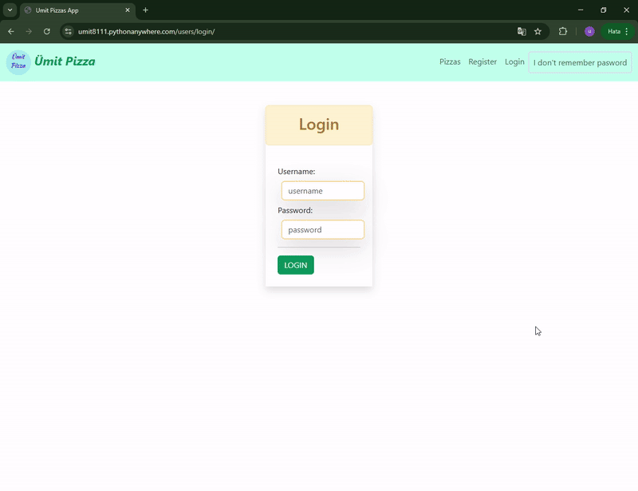
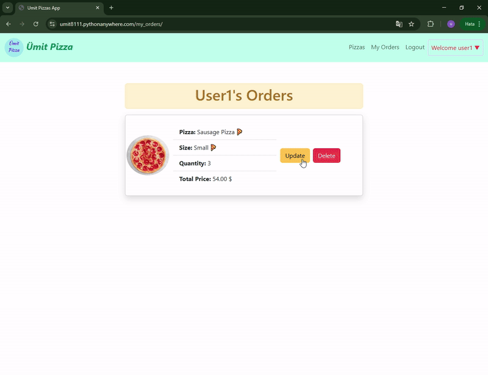

<!-- Please update value in the {}  -->

<h1 align="center">Project_Django_Template_Pizza_Ordering_App</h1>

<p align="center"><strong>🍕 Pizza ordering application with both backend and frontend developed with Django
 🍕<strong></p>
<p align="center">🍕 Django ile geliştirilmiş hem backend hem de frontend içeren pizza sipariş uygulaması 🍕</p>

<div align="center">
  <h3>
    <a href="https://umit8111.pythonanywhere.com/">
      Live Demo
    </a> 
  </h3>
</div>

<!-- TABLE OF CONTENTS -->

## Table of Contents

- [Table of Contents](#table-of-contents)
- [Overview](#overview)
  - [User Registration](#user-registration)
  - [User Login](#user-login)
  - [Ordering Pizza](#ordering-pizza)
- [Built With](#built-with)
- [How To Use](#how-to-use)
  - [Test User Information](#test-user-information)
- [About This Project](#about-this-project)
- [Key Features](#key-features)
- [Contact](#contact)

<!-- OVERVIEW -->

## Overview

### User Registration
<!--  -->


➡ User registration page for the application.

---

### User Login
<!--  -->


➡ The screen where users log in and order pizza.

---

### Ordering Pizza
<!--  -->


➡ Screen where users order pizza by selecting size and toppings.

---

## Built With

<!-- This section should list any major frameworks that you built your project using. Here are a few examples.-->
This project was developed using the following tools and libraries:

- [Django Templates](https://docs.djangoproject.com/en/5.1/topics/templates/): For creating dynamic web pages.
- [Bootstrap5](https://getbootstrap.com/docs/5.0/getting-started/introduction/): To provide a responsive and modern user interface.
- [django-crispy-forms](https://django-crispy-forms.readthedocs.io/en/latest/): To easily style forms.
- [dj-rest-auth](https://dj-rest-auth.readthedocs.io/en/latest/): User authentication and authorization module.


## How To Use

<!-- This is an example, please update according to your application -->

To clone and run this application, you'll need [Git](https://github.com/Umit8098/Project_Django_Templates_Pizza_App_CH-12_V.03)

When installing the required packages in the requirements.txt file, review the package differences for windows/macOS/Linux environments. 

Complete the installation by uncommenting the appropriate package.

---

requirements.txt dosyasındaki gerekli paketlerin kurulumu esnasında windows/macOS/Linux ortamları için paket farklılıklarını inceleyin. 

Uygun olan paketi yorumdan kurtararak kurulumu gerçekleştirin.

```bash
# Clone this repository
$ git clone https://github.com/Umit8098/Project_Django_Templates_Pizza_App_CH-12_V.03.git

# Install dependencies
    $ python -m venv env
    $ python3 -m venv env (for macOs/linux OS)
    $ env/Scripts/activate (for win OS)
    $ source env/bin/activate (for macOs/linux OS)
    $ pip install -r requirements.txt
    $ python manage.py migrate (for win OS)
    $ python3 manage.py migrate (for macOs/linux OS)

# Create and Edit .env
# Add Your SECRET_KEY in .env file

"""
# example .env;

SECRET_KEY =123456789abcdefg...
"""

# Run the app
    $ python manage.py runserver
```

### Test User Information
For the live demo, you can use the following test user information:
- **Username**: testuser
- **Password**: testpassword123
- **email**: testuser@gmail.com
This user can only place orders and update their profile.


## About This Project
This project is used to enable users to place pizza orders online. Users:
- Pizzas can be ordered in various sizes and options.
- Can track and manage their orders.
- User can perform account operations (registration, login, change password).
- It offers both front-end and back-end support with Django Template.

<hr>

Bu proje, kullanıcıların online pizza siparişi vermesini kolaylaştırmak amacıyla geliştirilmiştir. Kullanıcılar:
- Çeşitli boyut ve malzemelerle pizza siparişi verebilir.
- Siparişlerini takip edebilir ve yönetebilir.
- Kullanıcı hesap işlemleri yapabilir (kayıt, giriş, şifre değiştirme).
- Django Template ile hem frontend hem de backend desteği sunmaktadır.


## Key Features

- **Pizza Order Management**: Users can order pizzas with various sizes and toppings.
- **User Management**: Registration, login, profile editing and password change operations.
- **Order Tracking**: Users can view and manage their orders.
- **User Notifications**: After successful transactions, the user is given feedback via an on-screen message.


## Contact

<!-- - Website [your-website.com](https://{your-web-site-link}) -->
- **GitHub** [@Umit8098](https://github.com/Umit8098)

- **LinkedIn** [@umit-arat](https://linkedin.com/in/umit-arat/)
<!-- - Twitter [@your-twitter](https://{twitter.com/your-username}) -->

